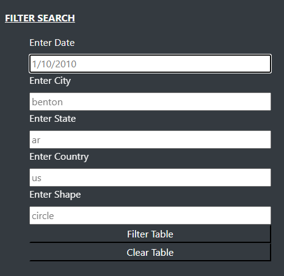
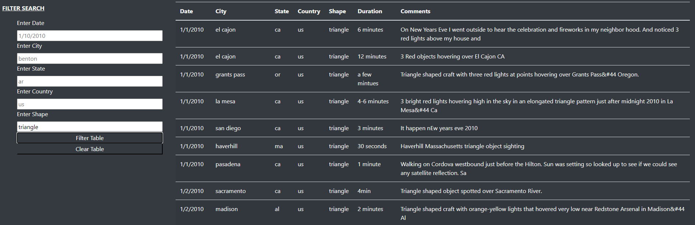

# UFOs

*by Ana Zeledon*

https://azeledon.github.io/UFOs/


## Overview

This project aims at creating a table to organize UFO data that is stored as a JavaScript array. Likewise, this table will have the ability to filter data based on certain criteria and will be created using JavaScript as the primary coding language.

JavaScript is a well-established coding language that was designed to enhance HTML. It's the backbone of many popular visualization libraries, such as Plotly, and is often used to create custom dashboards. JavaScript also provides a high level of customization: the dashboards built to deliver visual data, such as maps or graphs, can be as simple or complex as needed.

## Resources

- Data Tools: ECMAScript, JavaScript, Jupyter Notebook, Python and MongoDB
- Software: ES6+, ECMAScript, MongoDB, Python 3.6.8, Visual Studio Code 1.50.0

#### Statements and Expressions

- Statements perform actions.
- Expressions create values.

#### Code Blocks

Code blocks are denoted by curly brackets. Code inside the curly brackets are typically indented two to four spaces.

#### Variables

JavaScript adds var before the variable, and then add a semicolon after the value, like this: **var y = 2;**.

#### Create Variables with let

- When a developer chooses to use let, it basically means "I might want to use this variable again later to hold different data, but in this code block I'll only use it once." 

#### Create Variables with const

- const tells JavaScript that the variable won't be reassigned or redeclared, either in a block of code or within the program as a whole.

## Deliverables

1. **Deliverable 1**: Filter UFO sightings on multiple criteria
2. **Deliverable 2**: A written report on the UFO analysis README.md.

- The list element that creates the button is removed, and there are five list elements for filtering in the index.html file.



### Code

```
<!--Filter and Table-->
    <div class="container-fluid">
        <div class="row">
          <div class="col-md-3">
                <form class="bg-dark">
                    <p>Filter Search</p>
                    <ul class="bg-dark">

                        <!-- CHALLENGE NEED - Filter Using New <form> Tag-->
                        <li class="list-group" class="btn-dark">
                                <label for="date">Enter Date</label>
                                <input type="text" placeholder="1/10/2010" id="datetime" />
                        </li>

                        <li class="list-group" class="btn-dark">
                            <label for="city">Enter City</label>
                            <input type="text" placeholder="benton" id="city">
                        </li>

                        <li class="list-group" class="btn-dark">
                            <label for="state">Enter State</label>
                            <input type="text" placeholder="ar" id="state">
                        </li>

                        <li class="list-group" class="btn-dark">
                            <label for="country">Enter Country</label>
                            <input type="text" placeholder="us" id="country">
                        </li>

                        <li class="list-group" class="btn-dark">
                            <label for="shape">Enter Shape</label>
                            <input type="text" placeholder="circle" id="shape">
                        </li>

                    </ul>
                </form>
          </div>


          <!--Dynamic Table-->
          <div class="col-md-9">
                <table class="table table-striped">
                <thead>
                        <tr>
                            <th>Date</th>
                            <th>City</th>
                            <th>State</th>
                            <th>Country</th>
                            <th>Shape</th>
                            <th>Duration</th>
                            <th>Comments</th>
                        </tr>
                </thead>
                <tbody></tbody>
                </table>
          </div>
```

- The event listener is modified to detect changes to each filter in the app.js file. 

```
// 1. Create a variable to keep track of all the filters as an object.
var filters = {};

// 3. Use this function to update the filters. 
function updateFilters() {

    // 4a. Save the element that was changed as a variable.
    let inputElement = d3.select(this);
```
- The updateFilters() function saves the element, value, and the id of the filter that was changed.

```
function updateFilters() {

    // 4a. Save the element that was changed as a variable.
    let inputElement = d3.select(this);

    // 4b. Save the value that was changed as a variable.
    let inputValue = inputElement.property("value");

    // 4c. Save the id of the filter that was changed as a variable.
    let inputID = inputElement.attr("id");
```
- The filterTable() function loops through all of the filters and keeps any data that matches the filter values. 

```
// 5. If a filter value was entered then add that filterId and value
    // to the filters list. Otherwise, clear that filter from the filters object.

        if (inputValue) {
            filters[inputID] = inputValue;
        } else{filters ={};};
 
  
    // 6. Call function to apply all filters and rebuild the table
    filterTable(filters);
  
  }
  ```
  - The webpage filters the table correctly based on user input.



```
 // 7. Use this function to filter the table when data is entered.
  function filterTable() {
  
    // 8. Set the filtered data to the tableData.
    let filteredData = tableData;
  
    // 9. Loop through all of the filters and keep any data that
    // matches the filter values
    Object.entries(obj).forEach(([fkey, fval]) =>{
        
      filteredData = filteredData.filter((row) => row[fkey] === fval)
          

  });  
  
    // 10. Finally, rebuild the table using the filtered data
    buildTable(filteredData); 
  }
  ```
  
 ## Summary
 
 ### Drawbacks

- A potential drawback of creating a website as a JavaScript student is the risk of security vulnerabilities. Because JavaScript code is executed on the client-side, it can potentially be manipulated or exploited by malicious users to gain unauthorized access to user data or website functionality. This can include attacks such as cross-site scripting (XSS), cross-site request forgery (CSRF), and more.

- Another potential drawback is the challenge of optimizing website performance. Because JavaScript is a client-side scripting language, excessive use of JavaScript code can slow down website performance, especially on slower devices or networks. This can result in longer loading times and a poor user experience.


### Recommendations

- To mitigate the risk of security vulnerabilities, it is important to follow secure coding practices and to implement appropriate security measures, such as input validation, authentication, and authorization mechanisms. Additionally, regular security testing and vulnerability assessments should be performed to identify and address any potential weaknesses in the website's security infrastructure.

- To address the challenge of optimizing website performance, it is important to minimize the amount of JavaScript code used on a website and to optimize the performance of existing code through techniques such as minification, bundling, and caching. Additionally, best practices for website design and development, such as optimizing image sizes and minimizing HTTP requests, can also help to improve website performance.
